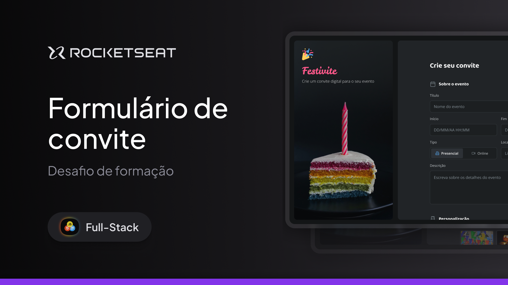

<h1 align="center"> Festivite </h1>

Programa exclusivo, promovido pela Rocketseat para ensino de tecnologias WEB.  
<a href="https://app.rocketseat.com.br/projetos/desafio-pratico-formulario-de-convite?module_slug=desafio-pratico-formulario-de-convite&origin=%2Fprojetos">Estude esse projeto em formato de vídeo clicando aqui.</a>

  <a href="#-tecnologias">Tecnologias</a>&nbsp;&nbsp;&nbsp;|&nbsp;&nbsp;&nbsp;
  <a href="#-projeto">Projeto</a>&nbsp;&nbsp;&nbsp;|&nbsp;&nbsp;&nbsp;
  <a href="#-layout">Layout</a>&nbsp;&nbsp;&nbsp;|&nbsp;&nbsp;&nbsp;
  <a href="#memo-licença">Licença</a>

  

 

  

## 🚀 Tecnologias

Esse projeto foi desenvolvido com as seguintes tecnologias:

- HTML e CSS
- Git e Github
- Figma

## 💻 Projeto

O DevLinks é um agregador de links para usar como cartão de visitas online.

- [Acesse o projeto finalizado, online](https://tiagoeleuterioreis.github.io/07_Convite/)

- [Assistir aulas](https://app.rocketseat.com.br/jornada/full-stack/visao-geral)

## 🔖 Layout

Você pode visualizar o layout do projeto através [DESSE LINK](https://www.figma.com/files/team/1448704269089373618/resources/community/file/1389649528880849780). É necessário ter conta no [Figma](https://figma.com) para acessá-lo.

## :memo: Licença

Esse projeto está sob a licença MIT.

---

Feito com ♥ by Rocketseat :wave: [Participe da nossa comunidade!](https://discord.gg/rocketseat)
